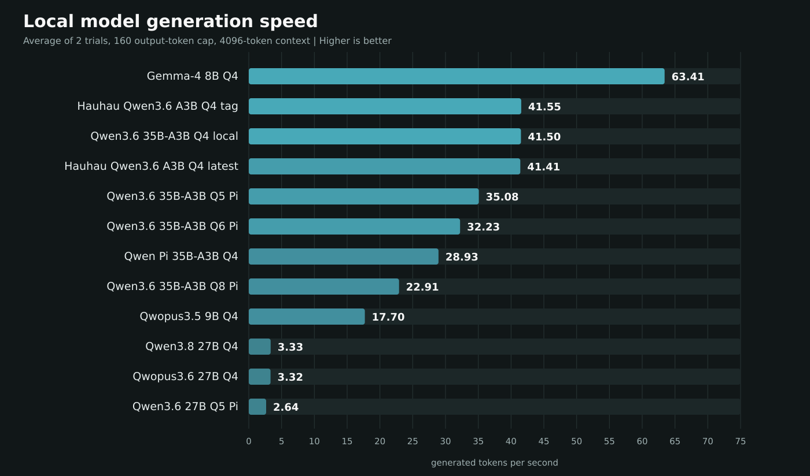

# Local Ollama model token-speed benchmark

Run started: `2026-09-01T20:31:09.139407-04:00`

- Hardware: AMD Ryzen 5 7600X, 64 GB RAM, NVIDIA GTX 1660 SUPER 6 GB
- Context: 4096 tokens
- Measured generation: up to 160 tokens per trial
- Trials: 2, after a 16-token warm-up
- Temperature: 0
- Models were tested sequentially through the local Ollama API and unloaded between tests.
- Generation tok/s comes directly from Ollama's `eval_count / eval_duration`.

| Rank | Model | Quant | Size | Generation tok/s | Range | Prompt tok/s | Load |
|---:|---|---|---:|---:|---:|---:|---:|
| 1 | Gemma-4 8B Q4 | Q4_K_M | 6.3 GB | **63.41** | 63.33-63.49 | 1013.8 | 5.0s |
| 2 | Hauhau Qwen3.6 A3B Q4 tag | Q4_K_M | 22.1 GB | **41.55** | 41.47-41.63 | 600.8 | 4.8s |
| 3 | Qwen3.6 35B-A3B Q4 local | Q4_K_M | 22.1 GB | **41.50** | 41.33-41.67 | 594.1 | 14.0s |
| 4 | Hauhau Qwen3.6 A3B Q4 latest | Q4_K_M | 22.1 GB | **41.41** | 41.21-41.61 | 605.2 | 4.7s |
| 5 | Qwen3.6 35B-A3B Q5 Pi | Q5_K_M | 28.0 GB | **35.08** | 35.05-35.11 | 518.9 | 15.0s |
| 6 | Qwen3.6 35B-A3B Q6 Pi | Q6_K | 30.6 GB | **32.23** | 32.16-32.30 | 508.6 | 15.7s |
| 7 | Qwen Pi 35B-A3B Q4 | Q4_K_M | 22.1 GB | **28.93** | 28.92-28.94 | 521.9 | 13.0s |
| 8 | Qwen3.6 35B-A3B Q8 Pi | Q8_0 | 43.6 GB | **22.91** | 22.73-23.09 | 381.4 | 21.7s |
| 9 | Qwopus3.5 9B Q4 | Q4_K_M | 6.5 GB | **17.70** | 17.63-17.76 | 478.5 | 6.2s |
| 10 | Qwen3.8 27B Q4 | Q4_K_M | 17.7 GB | **3.33** | 3.33-3.33 | 104.4 | 11.7s |
| 11 | Qwopus3.6 27B Q4 | Q4_K_M | 17.5 GB | **3.32** | 3.31-3.33 | 106.0 | 11.9s |
| 12 | Qwen3.6 27B Q5 Pi | Q5_K_M | 20.8 GB | **2.64** | 2.64-2.65 | 79.4 | 4.9s |

## Notes

Prompt throughput is based on a short prompt and is less stable than generation throughput.
Two installed Hauhau tags point to the same Ollama model digest; both were still tested as listed.
