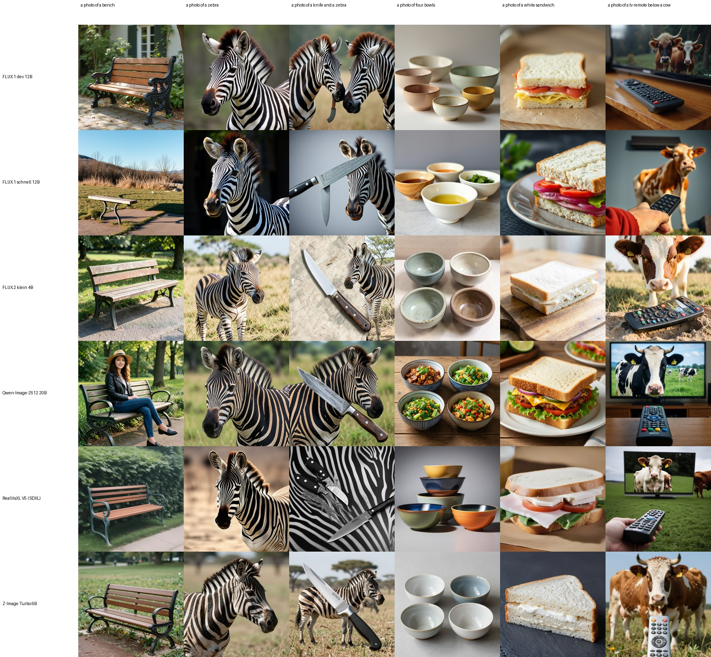

# Overnight ComfyUI text-to-image and text-to-audio test

Two Tesla P100-PCIE-16GB, ComfyUI 0.35.0, PyTorch 2.14.1+cu126, one ComfyUI server per GPU. Run 7–8 October 2026, report generated 2026-10-08T04:30:53.

Prompts are processed in a fixed order, so a model that ran out of time budget still has a prefix that compares directly with the others. Speed is the median per item after the first (the first includes model load). Each image is 1024×1024 with one seed per prompt (seed = 1000 + index). The Precision column shows what each model actually ran in (see the fp32 vs fp16 section).

GPU telemetry: GPU 0: max 79 °C, mean 206 W; GPU 1: max 71 °C, mean 178 W.

## Text → image (GenEval prompts, CLIP ViT-B/32)

*`samples/grid.jpg`: one row per model, the same six prompts across. Judge quality from the images; CLIP mostly tells you whether the objects are there.*

`CLIP common` averages over the 80 prompts every image model completed. CLIP cosine is a coarse prompt-alignment signal; it does not measure image quality.

| Model | Setup | Precision | Images | s / image | Images / min | CLIP common | CLIP all | Blank | Stop |
|---|---|---|---:|---:|---:|---:|---:|---:|---|
| FLUX.2 klein 4B | bf16 safetensors, Qwen3-4B encoder, 4 steps euler, cfg 1 | fp16 | 195 | 23.0 | 2.60 | 0.338 | 0.333 | 0 | budget |
| RealVisXL V5 (SDXL) | fp16 checkpoint, 25 steps euler_ancestral, cfg 6.8 | fp16 | 80 | 48.2 | 1.25 | 0.336 | 0.336 | 0 | reached prompt 80 |
| Z-Image Turbo 6B | GGUF Q8_0, Qwen3-4B encoder, 8 steps res_multistep, cfg 1 | fp16 | 80 | 68.6 | 0.87 | 0.334 | 0.334 | 0 | reached prompt 80 |
| Qwen-Image-2512 20B | GGUF Q4_K_M + Lightning 4-step LoRA, Qwen2.5-VL-7B fp8 encoder, cfg 1 | fp32 | 86 | 76.2 | 0.79 | 0.331 | 0.330 | 0 | budget |
| FLUX.1 dev 12B | GGUF Q8_0, CLIP-L + T5-XXL fp8, 20 steps euler, guidance 3.5 | fp16 | 80 | 228.9 | 0.26 | 0.329 | 0.329 | 0 | reached prompt 80 |
| FLUX.1 schnell 12B | GGUF Q8_0, CLIP-L + T5-XXL fp8, 4 steps euler | fp16 | 93 | 48.3 | 1.24 | 0.326 | 0.325 | 0 | budget |

CLIP by GenEval category (common prompts):

| Model | color_attr | colors | counting | position | single_object | two_object |
|---|---:|---:|---:|---:|---:|---:|
| Z-Image Turbo 6B | 0.370 | 0.339 | 0.316 | 0.329 | 0.303 | 0.347 |
| FLUX.1 dev 12B | 0.356 | 0.331 | 0.310 | 0.327 | 0.309 | 0.340 |
| FLUX.2 klein 4B | 0.371 | 0.331 | 0.321 | 0.349 | 0.309 | 0.346 |
| FLUX.1 schnell 12B | 0.355 | 0.321 | 0.308 | 0.328 | 0.302 | 0.344 |
| RealVisXL V5 (SDXL) | 0.376 | 0.340 | 0.316 | 0.337 | 0.312 | 0.336 |
| Qwen-Image-2512 20B | 0.363 | 0.331 | 0.304 | 0.339 | 0.303 | 0.346 |

### fp32 vs fp16 on the P100

ComfyUI keeps Pascal cards in fp32 on Linux. The run started that way; at 22:02 it was restarted with `--force-fp16`, which ACE-Step needs (it moves text encoders onto the GPU). The fp32 images made before the restart are compared here with the fp16 images for the same prompts and seeds.

| Model | Shared prompts | fp32 s / image | fp16 s / image | fp32 CLIP | fp16 CLIP |
|---|---:|---:|---:|---:|---:|
| Z-Image Turbo 6B | 56 | 65.2 | 68.6 | 0.335 | 0.335 |
| FLUX.1 dev 12B | 6 | 316.3 | 228.4 | 0.322 | 0.322 |

## Text → sound effects (AudioCaps test captions, CLAP)

| Model | Setup | Precision | Clips | s / clip | RTF | CLAP | Silent | Stop |
|---|---|---|---:|---:|---:|---:|---:|---|
| Stable Audio Open 1.0 | T5-base, 50 steps dpmpp_3m_sde, cfg 4.98, 10 s clips | fp32 | 100 | 11.3 | 1.12 | 0.104 | 0 | complete |
| Stable Audio 3 Medium | T5Gemma encoder, 8 steps lcm, cfg 1, 10 s clips, no prompt rewriting | fp32 | 100 | 2.0 | 0.20 | 0.191 | 0 | complete |

## Text → music (20 prompts, 10 instrumental + 10 with lyrics, CLAP vs. style tags)

| Model | Setup | Songs | s / song | RTF | CLAP all | CLAP instr. | CLAP vocal | Stop |
|---|---|---:|---:|---:|---:|---:|---:|---|
| ACE-Step 1.5 turbo | all-in-one checkpoint, 8 steps, 60 s songs, fp32 with `--gpu-only`; server restarted per song, so time includes loading the 10 GB checkpoint | 17 | 52.3 | 0.87 | 0.265 | 0.223 | 0.326 | complete |

## Text → speech (40 sentences; VibeVoice also 5 two-speaker dialogues; Whisper large-v3-turbo WER)

| Model | Setup | Precision | Clips | s / clip | RTF | WER mean | WER median | WER dialogs | Stop |
|---|---|---|---:|---:|---:|---:|---:|---:|---|
| Chatterbox | default voice, exaggeration 0.5, cfg 0.5 | fp32 | 40 | 2.0 | 0.57 | 0.000 | 0.000 | — | complete |
| Chatterbox Turbo | default voice | fp32 | 40 | 1.5 | 0.40 | 0.005 | 0.000 | — | complete |
| VibeVoice 1.5B | fp16, 10 diffusion steps, cfg 1.3; reference voices built from the Chatterbox and Chatterbox Turbo clips | fp16 | 45 | 3.8 | 0.86 | 0.006 | 0.000 | 0.000 | complete |

RTF = generation seconds per second of audio (below 1 is faster than real time).

## Problems during the night

- **vibevoice-1.5b**: 45 succeeded, 3 failed attempts. The 3 failed attempts were before 22:02: the node requires at least one reference voice. Fixed by building two reference voices from the Chatterbox clips; then 45/45. Errors: `VibeVoiceTTS: ValueError: No valid voice samples provided. Please connect at least one audio input as a voice sample for the speaker(s).`
- **ace-step-1.5-turbo**: 17 succeeded, 8 failed attempts. Never succeeded: music_10, music_14, music_15. Final fp32 run (`--gpu-only`). The remaining failed attempts are out-of-memory errors in the lyrics/audio-code language model; most succeeded once the server was restarted per song, but the songs listed as missing ran out of memory even on a fresh server: fp32 ACE-Step 1.5 is at the edge of 16 GB. Errors: `TextEncodeAceStepAudio1.5: torch.OutOfMemoryError: Allocation on device 0 would exceed allowed memory. (out of memory)`
- **qwen-image-2512-q4km-lightning4-fp16**: 86 succeeded, 1 failed attempts. The first image in fp16 was blank (fp16 overflow); the runner switched Qwen-Image to fp32 for the rest of the run. Errors: `blank image (likely fp16 overflow)`
- **ace-step-1.5-turbo-fp16vae**: 0 succeeded, 23 failed attempts. First music run (22:02, `--force-fp16`): the audio VAE ran in fp16 and every song came out saturated at full scale. Includes 3 earlier attempts (21:22) that failed because ComfyUI had put the text encoder on the CPU. All discarded; songs were regenerated in fp32. Errors: `fp16 audio VAE: output saturated at full scale (all samples ±1)`

## Files

- Per-item results: `results.jsonl` (generation time, launch flags and output path for every attempt); scores: `scores.jsonl`; summary: `summary.json`; runner log and per-minute GPU telemetry: `logs/`.
- `samples/`: the comparison grid and four shared prompts per image model, downscaled. The 676 full-size PNGs and 342 audio clips (1.1 GB) and the two ComfyUI server logs are not in the repo; they stay on the test machine under `~/Projects/Tests/2026-10-07/comfyui-image-audio/`.
- Runner, scorer and prompts: [`scripts/overnight_comfy_av.py`](../../../scripts/overnight_comfy_av.py), [`scripts/overnight_comfy_score.py`](../../../scripts/overnight_comfy_score.py), [`scripts/overnight_comfy_prompts.json`](../../../scripts/overnight_comfy_prompts.json). They expect ComfyUI at `~/AI/ComfyUI` with a cu126 venv (`.venv-cu126`, PyTorch 2.14.1+cu126; CUDA 13 builds no longer support sm_60).
